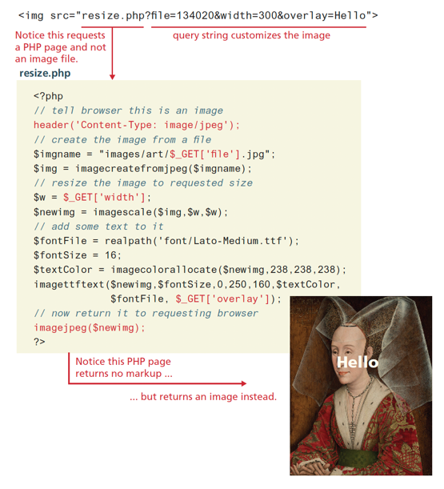
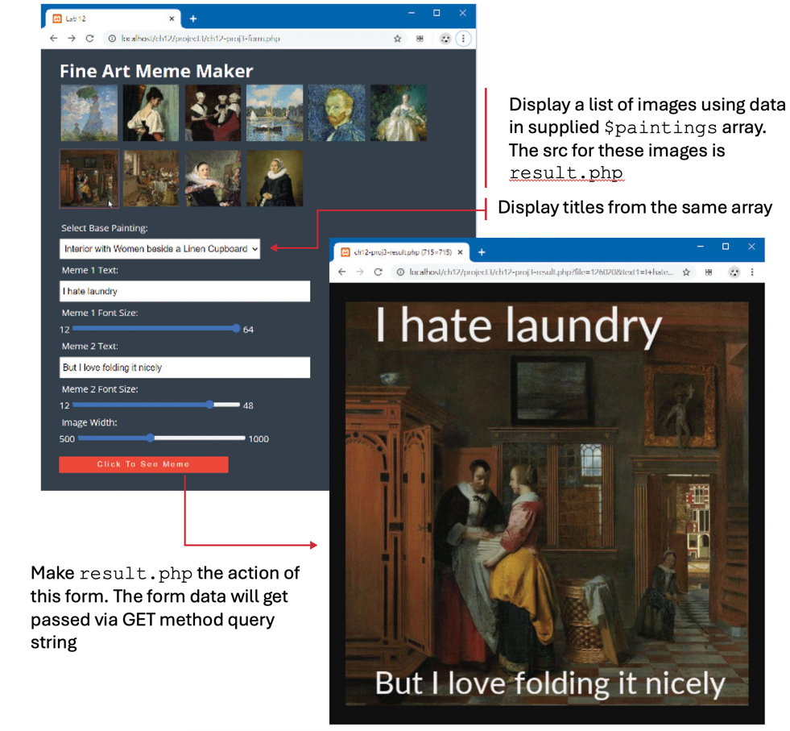

# In-class Server activity004
## Groups for this activity

## Forking this repo (BLAH BLAH BLAH ... the same verbiage as earlier)
To work on this project, you will need to create a personal copy of the repository. This is done by forking it. Follow these steps:
### 1. Fork repository
- Click the “Fork” button located in the upper right corner of the repository page.
- This will create a copy of the repository under your GitHub account. (only one in the project will do this!)
### 2. Clone Your Fork
- On your GitHub account, navigate to your forked repository.
- Clone the forked repository to your local machine.
### 3. Adding Collaborators
- Add your project members in the same way as you would for a normal repository.
- Go to `Settings`, `Collaborators` to add members to this repo.
### 4. New branch
- ***VERY IMPORTANT*** -> Create a new branch before you make any changes to the forked repo!!
- Once the branch is created, make the changes as per project requirements.
- You can make as many commits and as many pushes as needed to that branch that was newly created.
- To be consistent, use the same styling for commit messages that was given in the Project I.
    - [Prefix] – [Short description of the change]
      The following are the only possible options for [Prefix]:
    - FEAT - For new features or major additions to the project.
        - Example: `FEAT - Added contact form to the Contact page`
    - FIX - For bug fixes, corrections, or revisions to the code.
        - Example: `FIX - Corrected navigation bar alignment on mobile devices`
    - STYLE - For stylistic changes such as formatting, CSS modifications, or minor visual updates.
        - Example: `STYLE - Updated color scheme for better contrast`
    - DOCS - For changes or additions to the documentation, including README files and comments in the code.
        - Example: `DOCS - Added project description and setup instructions to README`
    - SECURITY - For changes related to improving the security of the website.
        - Example: `SECURITY - Implemented input validation for contact form`
    - REFACTOR - For code refactoring that doesn’t change functionality but improves code quality or organization.
        - Example: `REFACTOR - Organized CSS files and cleaned up redundant styles`
    - TEST - For adding tests or making changes to the testing suite.
        - Example: `TEST - Added validation tests for contact form input`

### 5. Submitting your work
Once, you are sure that all the work is completed, go through the following steps for submission.
- Go to your forked repository on GitHub.
- Click on the “Pull requests” tab and then the “New pull request” button.
- Select the branch you pushed your changes to.
- Click “Create pull request” and provide a title and description for your changes.
- Submit the pull request.
- If you have made a pull request on error or have made further changes to the branch, you can always close the pull request that was made and make a new pull request.
- The closest pull request to the due date will be reviewed.

### 6. Grading and Feedback
- After the submission deadline, your pull request will be reviewed.
- Feedback and grades will be provided based on the changes made and the quality of the work.

Not sure, how to create a pull request, check this [link](https://docs.github.com/en/pull-requests/collaborating-with-pull-requests/proposing-changes-to-your-work-with-pull-requests/creating-a-pull-request-from-a-fork).

# Project description
Demonstrate your ability to create a data-driven PHP page, use superglobal data,
and to modify HTTP header.

Ask ChatGPT on how to install PHP on your machine - windows/mac.

Once installed navigate to this cloned repo on the terminal and type in the following commands to check the successful installation and start the PHP server:

* `php -v`
* `php -S localhost:8000`

Open a browser and access the http://localhost:8000/form.html webpage.

1. Examine `form.php` and view in browser and then the editor of your choice.
   Notice that it contains a `<form>` using `method=get` and `action=result.php`. Examine `data.inc.php` that contains the data for the paintings to
   be displayed in this form. The `form.html` shows the markup that
   your code will have to generate.
2. You will implement `result.php` using code similar to that shown in
   Figure below, except rather than hard-coded font sizes and text labels, you
   will use the form data passed to it. Examining the form elements in `form.php` will indicate the values to use with the `$_GET` superglobal
   array.

  

3. Implement as well a `width` query string that, if present, will use the
   `imagescale()` function to return an image of the specified width (the height
   will be the same as the width). 
4. You can use this width parameter to generate the thumbnails at the top of
   `form.php` by adding a loop within the grid-container `<section>`.
   Simply loop through the supplied data array, and echo an `` element with
   the src attribute set to `result.php` that has a `file` querystring
   parameter set to the filename from the data array and a `width` querystring
   parameter set to 100. For the supplied JavaScript to work correctly, also set
   the `data-value` attribute of the img to the filename also. 
5. Generate the options for the `<select>` list using a PHP loop. Each `<option>`
   should have the value set to the filename. 
6. When done, the form and the result will look like that shown in Figure below.

  

7. Submit your custom meme files, that you generated for all the images by adding an appropriate text. Make it funny!

## Tips and Suggestions
* Start small: Break this problem down into smaller steps. First verify the globals are being read properly in the PHP file.
* You may decide to move your code into classes within your module after you
  finished your code, or you may decide to work with classes and modules right
  from the start.
* **DON’T USE ABSOLUTE PATHS**. Use only relative paths in your project files. This practice is particularly important when multiple people are working on the same project, as it ensures that links and references work correctly across different environments and systems.
* Iterate and Test: Continuously test your website after making necessary changes.
* Issues: Use the GitHub to create Issues and track the status of the issues using Milestones.
* Focus on Details: Pay attention to small details like spacing, hover effects, to create a polished final product.

